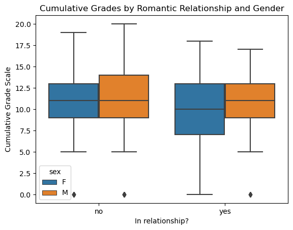
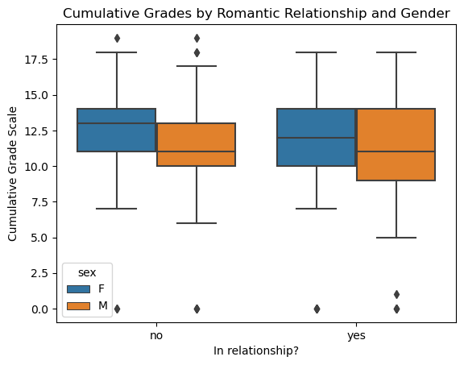
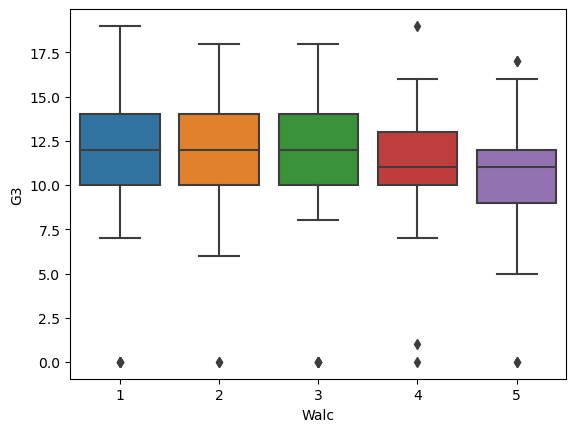
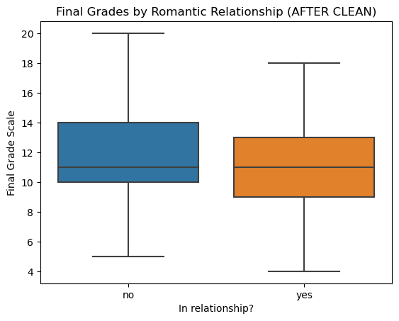
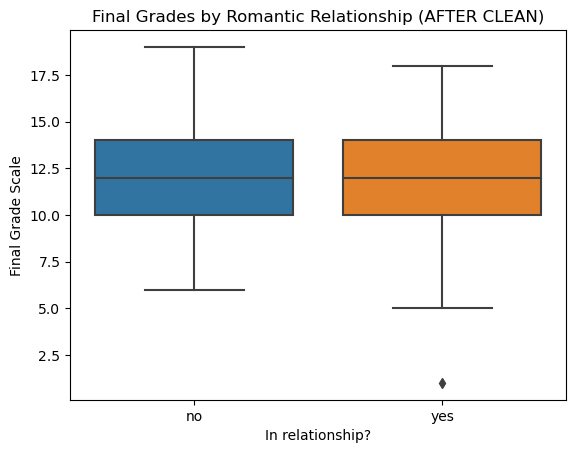
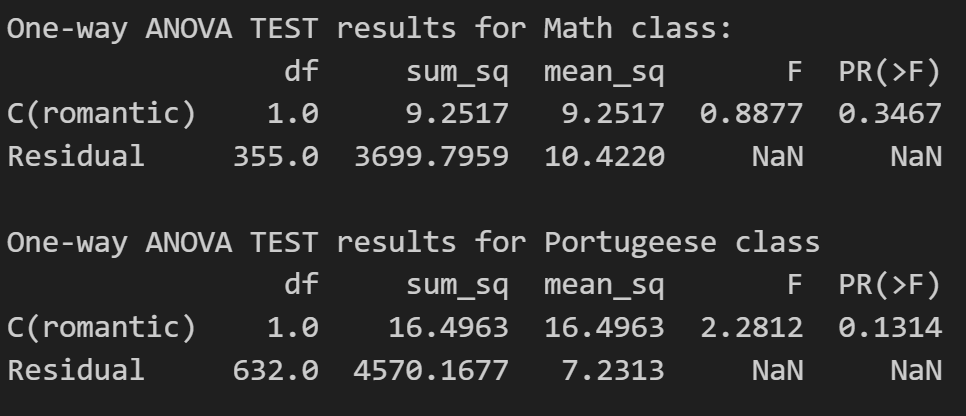

# Student Performance Analysis Project

 

## Introduction

This project focuses on analyzing the relationship between relationship status and the final grade performance of high school students in two distinct subjects: Mathematics (mat) and Portuguese language (por). The dataset comprises student grades, demographic, social, and school-related features collected through school reports and questionnaires.

**Source Reference:** The data was originally introduced by [Paulo Cortez](https://archive.ics.uci.edu/dataset/320/student+performance) and has been used for binary/five-level classification and regression tasks.

## Project Overview

In this section of the group project, we focused on multiple outside school factors that could determine the final grade of the high school students. The project proceeded through three main phases: exploration, data cleaning, and statistical analysis.

## Exploration

We start the exploration phase by creating boxplots to visualize the first two outside school factors like relationship between romatic status (yes or no) and final grades. The boxplots were generated for each class (Math and Portuguese) with the final grades on the x-axis, and gender (male or female) represented by different hues. This visualization aimed to provide an initial understanding of the data distribution.

### Boxplots: Relationship Status and Final Grades (Math Class)

### Boxplots: Relationship Status and Final Grades (Portuguese Class)

### Boxplots: Fina Grades and the Weekly use of alchol for Portuguese class 

Our next outside factor that were interested to us were weekly use of alchol (Walc). The boxplots were generated for Portuguese class with the final grades on the y-axis, and the Walc on the x-axis. 

### Boxplots: Fina Grades and the Weekly use of alchol for Portuguese class 

Lastly we compared the variable of extra after school support ‘studentsup’ with the sum of grades ‘G1+G2+G3’ and we noticed that students with support had at least a grade of 15 or above and those without the student support had much lower grades in the minimum range while exploring!
y-axis represent the sum of grades and x-axis represent the studentsup. 

## Data Cleaning

During the exploration, outliers were identified in the boxplots. Further investigation revealed that some students had zero absences but lacked a final grade, despite having grades for G1 and G2. To address this issue, these rows were dropped, and updated boxplots were generated to visualize the cleaned data without outliers.

### Cleaned Data Boxplots (Math Class)

### Cleaned Data Boxplots (Portguess Class)

## Statistical Analysis

The statistical analysis utilized a one-way ANOVA to examine the main effect of relationship status on the final grades of students in both Math and Portuguese classes. Hypotheses were formulated, and the significance level (alpha) was set at 0.05.

**Hypotheses:**
- Null Hypothesis (H0): There is no main effect of relationship status on the final grades of the students.
- Alternative Hypothesis (H1): There is a main effect of relationship status on the final grades of the students.

### One-way ANOVA Results

For the Math class, the p-value associated with the relationship status variable (Romance and Grades) is 0.4021. Since this p-value is greater than the significance level (alpha) of 0.05, we fail to reject the null hypothesis (H0). Therefore, we conclude that there is NO main effect of relationship status on the final grades of the students in Math Class.

For the Portuguese class, the p-value associated with the relationship status variable (Romance and Grades) is 0.1314. Since this p-value is less than the significance level (alpha) of 0.05, we fail to reject the null hypothesis (H0). Therefore, we conclude that there is NO main effect of relationship status on the final grades of the students in Portuguese class.

## Linear Regression Model

The final step involved building linear regression model to predict the final grades (G3) using relevant predictors. Four variables (relationship status, grades for G1 and G2, and gender) were selected as predictors, with G3 as the target variable. The mean squared error and R-squared values were computed for both Math and Portuguese classes.

**Results:**
- *Math Class:*
  - Mean Squared Error: 0.6888
  - R-squared: 0.9285

- *Portuguese Class:*
  - Mean Squared Error: 0.8733
  - R-squared: 0.8934

## Conclusion

The project concludes that there is no significant main effect of relationship status on the final grades of high school students in either Math or Portuguese classes. The linear regression models, incorporating relevant predictors, demonstrated high R-squared values, indicating their effectiveness in predicting final grades.

Feel free to explore the provided code and visualizations to gain a deeper understanding of the analysis conducted in this project.

## Next Step

The project presents opportunities for further exploration and improvement:

- **Explore Additional Variables:** Exploring additional features or creating new ones could enhance the predictive power of the linear regression models. Consider investigating the impact of variables such as parental education, study habits, and extracurricular activities on student performance.
