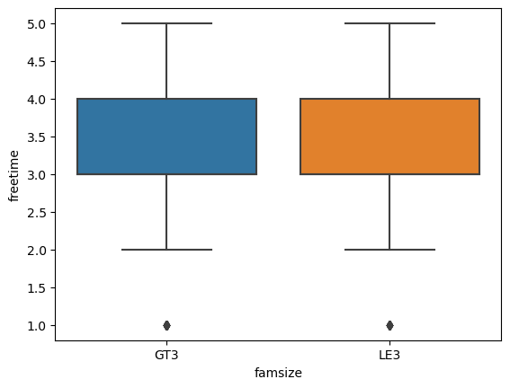
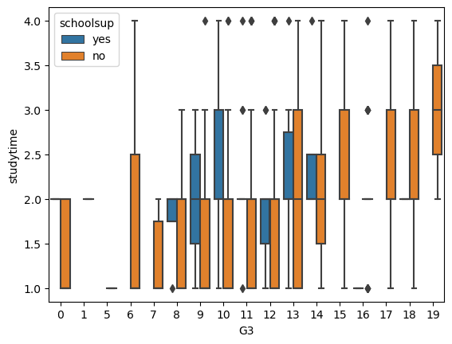
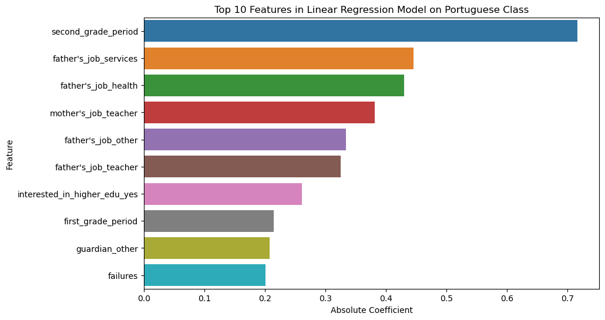
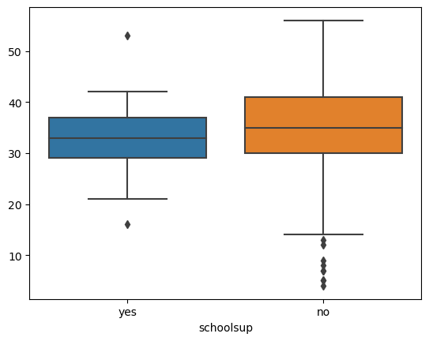
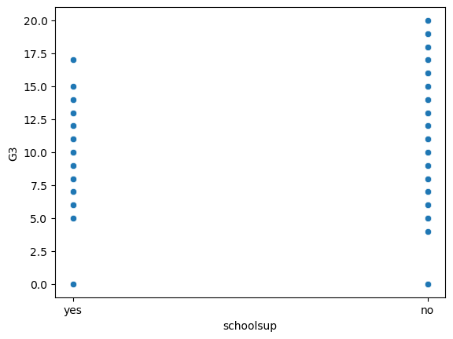

# end-of-phase1-project
To determine any correlation between a students demographic and student performance, I first analyzed the variable 'goout' and 'freetime' to see if having more time yields greater final grade "G3". 
I first utilized scatterplot and boxplot for 'fam size' in correlation with 'freetime'

I then utilized a boxplot for 'freetime' and midterm first grade 'G1'

I then utlized a boxplot to compare all three variables 'schoolsup', 'G3', 'studytime' to see if there is any correlation

I noticed there was no correlation between student performance and the free time and go out.

Finally I compared the variable of extra after school support 'studentsup' with the sum of grades 'G1+G2+G3' and I noticed a correlation while exploring!

I looked to see if there were any outliers and removed them

 

using # dropped outliers
df_p_drop_val = df_p.drop(df_p[(df_p['G3'] == 0) & (df_p['schoolsup'] == 0)].index)

Afterwards, I conducted ttest for all variables 'go out' 'freetime' 'schoolsup_yes' and found p-value to be 0.
Futhermore, I did a linear regression model to compare schoolsup_yes with final grade 'G3' and found no correlation with Mean Squared Error: 10.268869434623412
R-squared: -0.01867436306531478
So for now, our null hypothesis for the topics we were analyzing is that there is no impact between going out and having free time on student academic performance. The alternative hypothesis is that there is an influence going out and having free time. We found no evidence of correlation during our exploration so we will reject on our null hypothesis as there was a p-value=0
Finally, with our linear regression result of Mean Squared Error: 10.268869434623412
R-squared: -0.01867436306531478 we see no impact between students with school support with their performace. So our null hypothesis for the topics we were analyzing is that there is no impact between school support on student academic performance.The alternative hypothesis is that there is an impact between school support on student academic performance. We will reject our null hypothesis as we have no impact on school support with student final grades.
