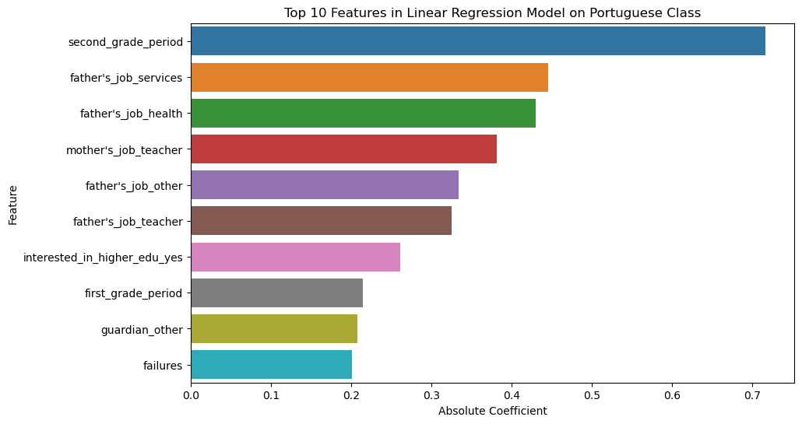

# end-of-phase1-project
# Linear Regression Model on Student Performance


## Project Overview

This project delves into data from two Portuguese schools, looking into how students fare in secondary education. We've got grades, demographics, social factors, and school details gathered from reports and questionnaires.


## Dataset Overview

Two distinct datasets are provided, each corresponding to the performance of students in two subjects: Mathematics (`data/raw/student-mat.csv`) and Portuguese language (`data/raw/student-por.csv`)

## Target Attribute

G3 is the final grade in the last year, tightly linked to G2 and G1, grades from the 2nd and 1st periods. Predicting the future is easier with a glance at the past.

## Goal
Predict student success (G3) using regression.

## Project Workflow

### Part 1: Exploratory Data Analysis
#### Load data

```python
import pandas as pd

import matplotlib.pyplot as plt
import seaborn as sns

df = pd.read_csv('../data/raw/shopping.csv')
```
#### Visualizing data
- Univariate Analysis


- Bivariate Analysis


ex. Two examples of the many charts built in 01explore.ipynb

### Part 2: Data Transformation
- Clean and transform the dataset to answer primary questions
- Check for null values, drop columns, drop rows
- Save new DataFrame to "data/processed" folder in project 


### Part 3: Build Model
#### Load data
```python 
import pandas as pd
import numpy as np

import matplotlib.pyplot as plt
import seaborn as sns

from scipy import stats

math = pd.read_csv('../data/processed/cleaned0student-mat.csv')
```
#### Build 
- Scale data
- Split
- Model

```python
model = LinearRegression()
model.fit(X_train, y_train)

y_pred = model.predict(X_test)
```

## Conclusion and Further Steps

### Math class Linear Regression Model output:
```python
mse = mean_squared_error(y_test, y_pred)
r2 = r2_score(y_test, y_pred)
print('Mean Squared Error:', mse)
print('R-squared:', r2)
```
Mean Squared Error: 0.8077187190394328

R-squared: 0.9162975074942504

### Portuguese class Linear Regression Model output:
```python
mse = mean_squared_error(y_test, y_pred)
r2 = r2_score(y_test, y_pred)
print('Mean Squared Error:', mse)
print('R-squared:', r2)
```
Mean Squared Error: 0.8115800321982726

R-squared: 0.8906814850654576

### Insights
These images depict the top 10 features with highest coefficients in each model. Indicating that these features are most responsible for prediciting.





### Challenges

- How to deal with outliers

### Further steps

- first_grade_period and particularly second_grade_period were very influential in this linear regression, could we fit a model that is as good at predicting without them?
- ridge and lasso
- write more comprehensive README
